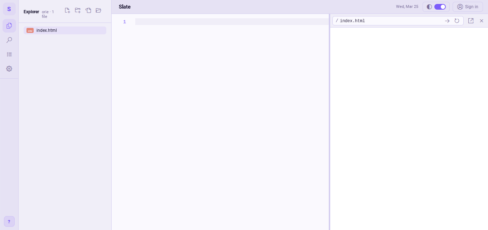
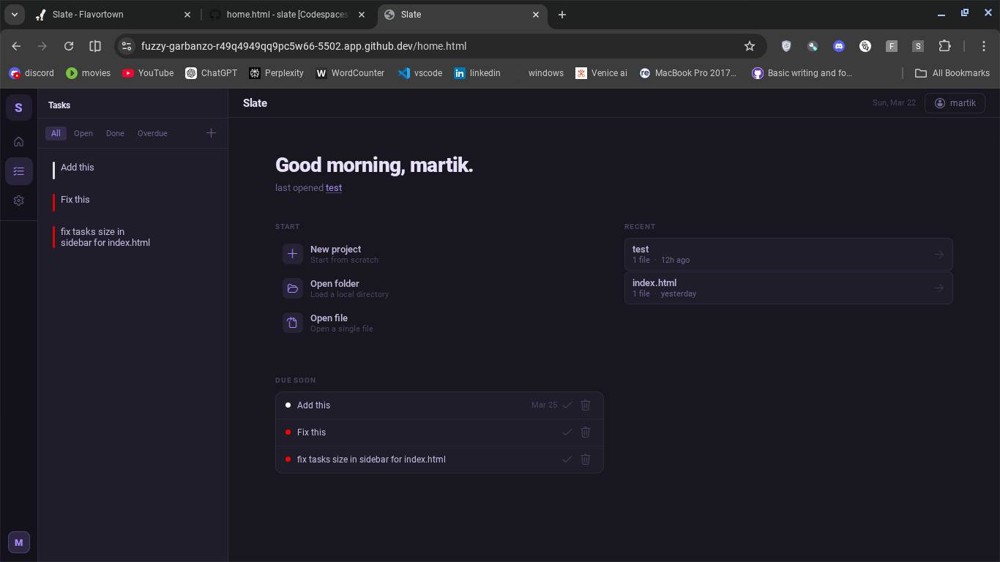

# Slate

**A lightweight, browser-based code editor built for speed.**

Live preview · Syntax highlighting · Task manager · Vim mode · Multi-file projects

---

## What is Slate?

Slate is a VS Code-inspired code editor that runs entirely in the browser — no install, no backend, no setup. Open a file or folder, start editing, and see your HTML rendered live side-by-side. It stores your projects, tasks, and settings locally so everything persists between sessions.

---

## Features

**Editor**
- Monaco Editor core (the same engine that powers VS Code)
- Syntax highlighting for HTML, CSS, JS, TS, Python, Go, PHP, Java, C/C++, SQL, Bash, and more
- Custom autocomplete with snippets for every supported language
- Vim mode — normal, insert, and visual modes, text objects, registers, marks, and `:` command line
- Tab management with drag-to-reorder, unsaved indicators, and per-file history
- Find & replace across all open files with regex, case, and whole-word options
- Adjustable font size, tab size, cursor style, word wrap, and bracket colorization

**Live Preview**
- Side-by-side HTML preview with auto-refresh on save
- Inline CSS and JS asset resolution — linked stylesheets and scripts render correctly
- Resizable split pane, URL bar for navigating between files, open-in-new-tab

**Project Management**
- Open individual files or entire folders
- File tree with create, rename, duplicate, delete, and drag-to-move
- Recent projects on the home screen with timestamps

**Task Manager**
- Create tasks with title, description, due date, and colour
- Filter by all / open / done / overdue
- Tasks persist per user across sessions

**Accounts**
- Terminal-style sign-up and login
- All data (projects, tasks, settings, marks) scoped per user via localStorage

---

## Try it

| Page | Link |
|------|------|
| Home | [martikdev.github.io/slate/home.html](https://martikdev.github.io/slate/home.html) |
| Editor | [martikdev.github.io/slate/index.html](https://martikdev.github.io/slate/index.html) |

No installation needed — open the link and start coding.

## Keyboard shortcuts

| Shortcut | Action |
|----------|--------|
| `Ctrl + S` | Save file |
| `Ctrl + Shift + S` | Save as |
| `Ctrl + N` | New file |
| `Ctrl + O` | Open file |
| `Ctrl + Shift + F` | Search across files |
| `Alt + P` | Toggle live preview |

**Vim mode** (enable in Settings → Vim):

| Key | Action |
|-----|--------|
| `i / a / o / O` | Enter insert mode |
| `v / V` | Visual / visual line |
| `d / c / y` + motion | Delete / change / yank |
| `ci" / da( / yiw` | Text objects |
| `"a y / "a p` | Named registers |
| `ma / 'a` | Set / jump to mark |
| `:w / :q / :wq` | Save / quit / both |
| `:%s/foo/bar/gi` | Global substitution |

---

## Screenshots

---

## Roadmap

- [ ] GitHub integration — clone and push directly from the editor
- [ ] File type icons (Python, HTML, JS, etc.)
- [ ] Profile page
- [ ] Terminal panel
- [ ] Mobile layout

---

## Tech stack

| Layer | Technology |
|-------|------------|
| Editor | [Monaco Editor](https://microsoft.github.io/monaco-editor/) 0.44 |
| Icons | [VS Code Codicons](https://github.com/microsoft/vscode-codicons) |
| Storage | `localStorage` (no backend) |
| Deployment | GitHub Pages |

---

Built by [martikdev](https://github.com/martikdev)

